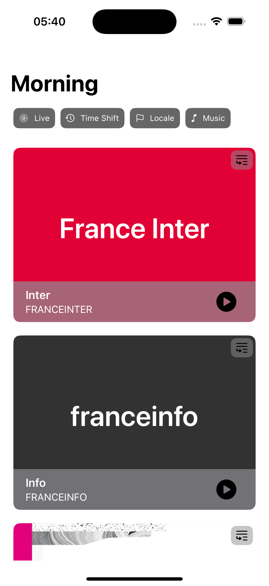
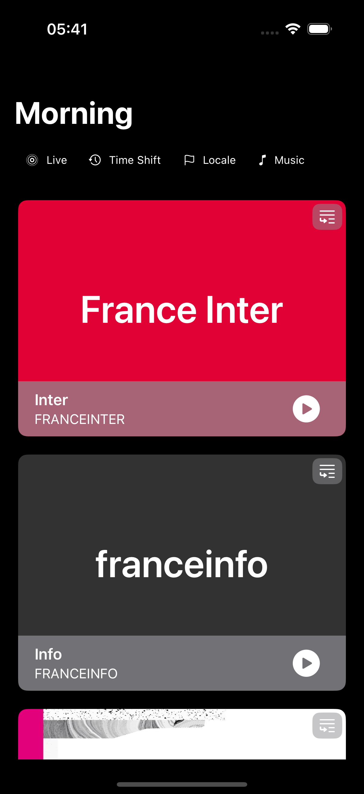
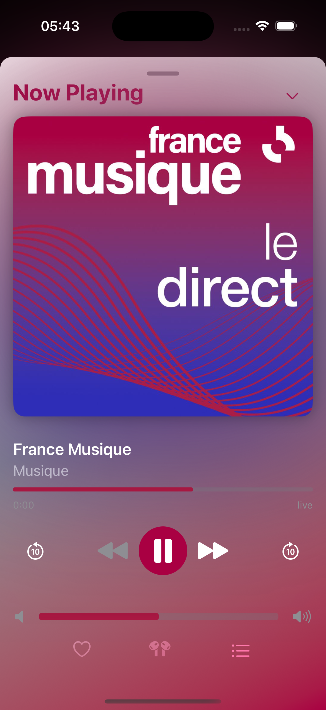
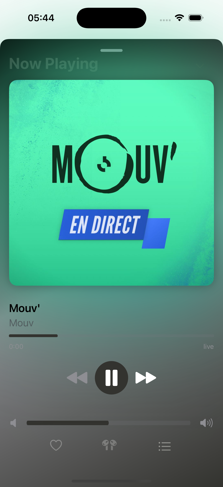
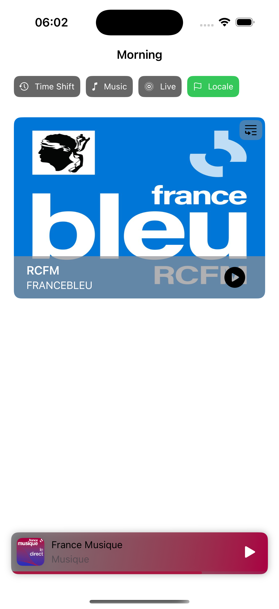
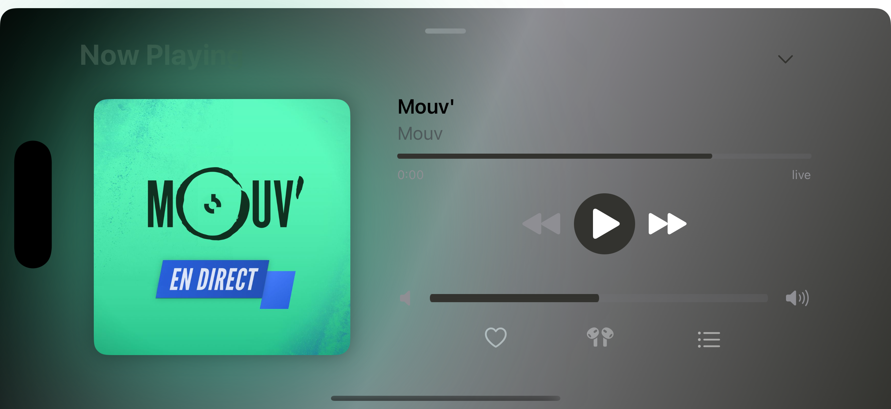
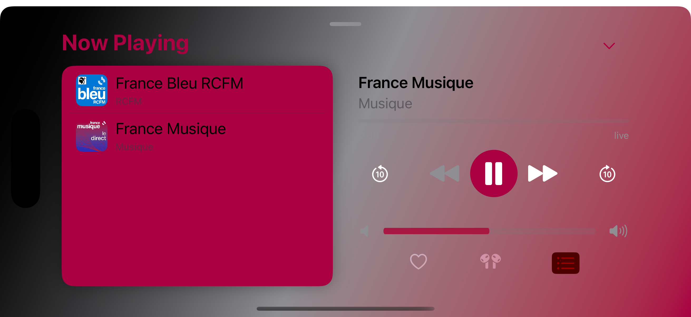
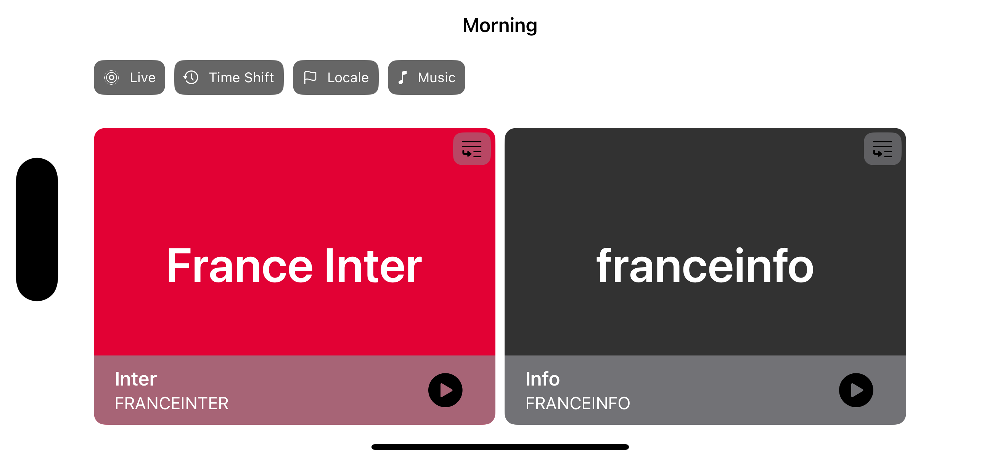

# Technical Test - My Little Radio

| My Little Radio (GIF) |
| - |
|  |


## 1. Architecture & Code Quality

**Architecture Overview**:
- **Modular Clean Architecture**: Multiple Swift packages used to ensure each module is reusable, testable, and maintainable.
- **Swift Package Manager**: Each layer is in distinct packages:
  - **Domain Package**: Core business logic and Models, independent of UIKit
  - **Data Package**: Repository and datasource implem, handling data access
  - **Requester Package**: Used only by the Data package, offers a Service Provider API calls
  - **Awesome Player**: Packaging the App player making it independent of the App. More below :) 
- **App**: Where `TCA` features, communicate with use cases from the Domain Package to perform it's tasks
    - **Composition**: App composing and Dependency injection
    - **Dependencies**: Use of TCA Dependency as a DI

**Clean Arch Layers**:
- **Domain**:
  - Repository Proto: Abstract data access 
  - Use Cases: Implements App logic
- **Data**:
  - Repository: concrete implem for accessing data
  - Data Sources: Use of `Requester` package to make the API call
- **Requester**: reusable networking call package that is generic, tested and fully scallable

**DI**: 
    - Approach taken is different to what TCA been doing but clearly not forbidding it, on contrary, in their videos about TCA cross platform (for the Web), @Brandon is advocating for a separation of domain and the presentation layer into independent packages to allow better reusability. This separation based on the good practices on making business logic not depend on third party libraries, made that the `TCA` Dependency is used on the App side and not the package side while package uses the exposed Factory. 
    -- Yes, this is argumentative, and will be happy to discuss --

**Benefits**:
- **Granular Separation**: Each module with it's' specific function, making app easier to maintain, test and evolve
- **Reusable**: Can be reused cross apps
- **Scalable**: A modular design makes it easy to add new or modify existing features
- **Easier Dependency Management**: Package are decoupled from iOS's 'UIKit, making it platform agnostic
- **Optimized Xcode Build Times (YES)**: Packages are built, run, tested on macOS target allowing x10 faster iterations :)
  - Use of dynamic framework to help with build time with SPM's `.dynamicPackage` property.

## 2. Functionalities & Features

- **Player Module**:
  - Built as an independent Swift Package with `TCA` as a dependency, ready to be integrated
  - **Dependency Inversion Principle**: Player module abstracts `AVFoundation` using protocol design, enabling easy swapping of audio interfaces while maintaining a consistent interface with external modules
  - Audio Interfaces (like AVFoundation) can be implemented on the Application side and DI injected using the factory pattern
  - A default implementation based on AVFoundation's `AVQueuePlayer`, for managing the queue.
  - Uses Combine's `AsyncPublisher` to adopt KVO, NotificationCenter obervation
  - Complete UI components, with animations and transitions
  - Has two UI options, Extended and Retracted.
  - Extended TUs.
  - ** Feature support by the Player**:
    - **Floating UI**: Player is accessible from the entire application (2 screens).
    - **Queuing**: Allow to add Radios to the queue while allowing preview of the queue, jump in item of the queue, all while being on the player interface
    - **Auto Scrolling Text**: Text bigger than allocated viewport is auto scrollable with animation (PLEASE, change the content of the mock with lenghtier text to see the animation)
    - **Play / Pause**
    - **Progress and TimeShiftable**: Media with enabled Time shift can navigate the progress bar with swipeable gestures  
    - **Volume**: Drag gesture volume bar
    - **Color Theme**: Uses the station primary color to adapt to each station :) 

- **TCA Navigation**:
  - Uses TCA's navigation `Path` based on SwiftUI’s `NavigationStack`

- **Dynamic Filters**:
  - Filters is generic TCA Reducer and can be easily reused with other stores (TCA approach)
  - Are computed and generated dynamically from the use case, based on the server response

- **Basic Service And Player Error Handling**

## 3. User Interface

- **Device Support**:
  - Smaller devices with adaptive layouts using `LazyVStack`'s `Grid` content, and SwiftUI's `AnyLayout` protocol.

- **Orientation Support**:
  - Fully supports both **Portrait** and **Landscape** modes across the app, with auto adapting lists for an optimized experience on both orientations

- **Light Dark Support**:
  - Minimal support - with beautiful Gradients ( Developers are not great designers :D )
  
## 4. Notes

- **Main Focus**: 
  - Focus was made on the reusability while having a feature teams structure, this approach is beneficial for the separation.
  - Player was the main focus point for it's Dependency Inversion from AVFoundation, while being Module based, App independent, greatly testes, implement it's UIs and controls, animation and transitions.
  - Concurrency: Swift Full Concurrency Check enabled on all packages and the project.
  - Due to missing content, Detail Page may look empty
  - Some part may look over-engineered?, but my focus was to show capabilities and adaptabilities.
  - Great focus on UI, Animations, interaction, gestures and exploit SwiftUI Modifiers approachs
  - Took some of the UI approaches from Radio France, iOS Music and Spotify App, credits due.
  - TUs and Code coverage
  
## 5. What could have been done
  - Favorite Radio Station (Using TCA' Shared Property Wrapper)
  - Carousels
  - Caching
  - `MPNowPlayingInfoCenter`
  - .. more
 
  Doing all of the features, will make the app more production ready but importantly heavier and harder to review .. and also time.

## 6. Project Setup

- Project is built on Xcode 16
- Support of iOS16
- Swift 6 and Full Checked Concurrency

## 7. Preview

| Main (Light) | Main (Dark) | Filter |
| - | - | - |
|  |  |  |  |

| Detail (Light) | Detail (Dark) |
| - | - |
|  |  |

| Player FR Musique | Player Mouv (disabled timeshift) | Floating Player |
| - | - | - |
|  |   |   | 

| Player landscape | Player Playlist | 
| - | - |
|  |  |

| Home landscape |
| - |
|  |

--- 

### Original

&#x20;This project is built with **SwiftUI** and **The Composable Architecture (TCA)**. We understand that TCA might not be familiar to all candidates, so we have provided a basic application skeleton to help you get started.

## Project Overview

The project consists of:

1. **SwiftUI Application**: The initial app displays a list of radio stations without any specific design. This list is managed by a **Reducer** and uses a mock data dependency provided via TCA's **dependencies** module.

2. **Mock Server**: We have included a simple Node.js server that exposes a list of radio stations. The server can be started to serve data from `http://localhost:3000/stations`.

The goal of this test is to assess your ability to enhance an existing SwiftUI application using TCA principles, improve the UI, and add meaningful features.

## JSON Data Format

The data from the Node.js server is structured in the following format:

```
{
  "stations": [
    {
      "id": "7",
      "brandId": "FIP",
      "title": "FIP",
      "hasTimeshift": false,
      "shortTitle": "Fip",
      "type": "on_air",
      "streamUrl": "https://icecast.radiofrance.fr/fip-midfi.mp3",
      "analytics": {
        "value": "fip",
        "stationAudienceId": 7
      },
      "liveRule": "apprf_fip_player",
      "colors": {
        "primary": "#e2007a"
      },
      "assets": {
        "squareImageUrl": "https://www.radiofrance.fr/s3/cruiser-production/2022/05/a174aea6-c3f3-4a48-a42c-ebc034f62c10/1000x1000_squareimage_fip_v2.jpg"
      },
      "isMusical": true
    },
    ...
  ]
}
```

## Requirements

We'd like you to enhance the project with the following features:

1. **Replace Mock Data with Server Call**

   - Replace the mock station data with a network call to the Node.js server at `http://localhost:3000/stations` to fetch the list of stations.

2. **Navigation to Station Details Page**

   - When a user clicks on a station in the list, they should be navigated to a details page for that station.
   - The detail page should be implemented in accordance with the existing architecture (using TCA's Reducer and View principles).

3. **Play Station Stream**

   - Add functionality to allow users to play the stream of a selected station.
   - This should be integrated in the details page and respect TCA's architecture.

4. **Improved User Interface**

   - Enhance the overall look and feel of the application using **SwiftUI**.
   - Feel free to use animations, custom components, or anything that can improve the user experience.

## Getting Started

1. **Fork the Repository**

   - Fork the project repository from the provided URL.

2. **Run the Mock Server**

   - Navigate to the `server` folder.
   - Run `npm install` to install the necessary dependencies.
   - Start the server with `node server.js`.

3. **Run the iOS Project**

   - Open the Xcode project.
   - Trust and enable the macros for the TCA and Dependencies libraries to ensure proper functionality.
   - The app should be able to run and display a list of mock stations generated locally.

## Submission Guidelines

- Fork the repository and make your changes.
- Please include a README file detailing the changes you've made, including any decisions or trade-offs you encountered you've made and any decisions or trade-offs you faced.

## Evaluation Criteria

- **Architecture**: How well you respect and extend the existing TCA architecture.
- **Code Quality**: Readability, organization, and use of best practices.
- **Functionality**: Successful implementation of the requested features.
- **User Interface**: Design quality and overall user experience.

Feel free to ask questions if anything is unclear. Good luck, and happy coding!
